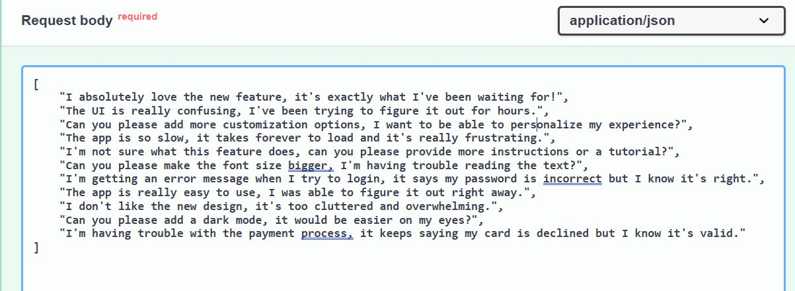

# Radary

 > **A novel AI application integrating computer vision and NLP via LLM to report and address accidents and eco-issues enhancing public safety and environmental sustainability.**

---

# How to use API?
Click on [API](radary-production.up.railway.app/docs) to go to the deployed version of the API.
this will open the API interface page like this

 

# Analyse Eco-Accident Endpoind
### Problem Statement
In emergency situations, such as accidents or fires, timely reporting to the relevant authorities like hospitals, police, or fire stations is crucial to save lives. However, in some cases, calling the emergency services may not be necessary or possible. wherefore we are motivated to develop an Ai-powered application that enables users to upload a live photo of the incident, which is then analyzed to assess the danger level and automatically send a report to the nearest relevant authority.

### Gemini will take an image then give a three items based on an instruction prompt:   	
•	**Short Description of the Accident:** Gemini can generate a concise description of the accident, providing context and understanding of the situation.

•	**Suggested Service:** The necessary service required to address the situation, such as emergency response or medical assistance.      

•	**Danger Level:** Level from 1 to 100, with 1 being minimal risk and 100 being extreme risk, to help prioritize the response to this situation.  

 
**Open the endpoint and click on `Try it out`**   
This will open to you an uploader object to upload your image throught.   
**You can use the potos in `Test folder` and choose from images that named `accident1/2/3/4jpg`.**   

 

**After uploading the image click on `Excute`**        
this will show you a response like this **for EX this response related to `accident1.jpg` photo**.  

 

---

# Analyse Issue Endpoind
### Problem Statement  
Local authorities face a significant challenge in prioritizing and addressing environmental issues reported by citizens, such as pollution, broken streetlights, and garbage collection. The manual process of reviewing and prioritizing these issues is time-consuming, inefficient, and often leads to delayed responses, exacerbating the problems and negatively impacting the environment and public health.
The goal is to develop an Ai-powered system that can efficiently prioritize environmental issues reported by citizens, enabling local authorities to respond promptly and effectively, and ultimately contributing to a more sustainable environment.

### Gemini will take an image then give a three items based on an instruction prompt:   	
•	**Short Description of the Issue:** A concise and accurate description of the environmental issue.  

• **Recommended Authority:** The most relevant authority to contact in order to resolve the issue.     

•	**Priority Level Assignment:** A priority level from 1 to 5 with 1 being maximum priority and 5 being minimum priority.  

**After uploading the image click on `Excute`**     
this will show you a response like this **for EX this response related to `issue1.jpg` photo**. 

 

----

# Summarize Feedbacks Endpoind
### Problem Statement  
The feedbacks endpoint is a critical component of the AI-powered system, as it enables the collection and analysis of citizen feedback on the system's performance. The endpoint takes a list of feedbacks as input and provides a short and concide summary to be easy for us to capture all users feedbacks to help in identifying the strengths and weaknesses of the system.

### Gemini will take a list of feedbacks and generate a short concise summary:   	
•	**Summary:** A verbose summary of the users feedbacks.  

**After clicking on `Try it out` and put your feedbacks as a python list then click on `Excute` you can see the summary generated in response body**          
**you can use ` feedbacks.txt` from `Test folder` to copy feedbacks from and test with**.  
this is a sample list for example  

 

---

# Sentiment Analysis Endpoind
COMMING SOON ....
